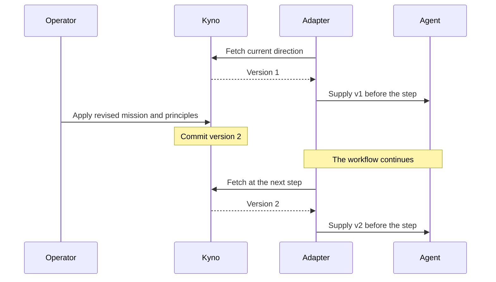

# Kyno

[](https://pypi.org/project/kyno/)
[](https://github.com/cizambra/kyno/actions/workflows/ci.yml)
[](https://pypi.org/project/kyno/)
[](https://github.com/cizambra/kyno/blob/main/LICENSE)
[](https://cizambra.github.io/kyno/)

**Kyno makes direction a first-class runtime primitive.** It gives running
agents a shared, versioned source of mission and principles, with its own
identity, current version, history, and interface for retrieving it.

Suppose your sales agent is optimizing for new revenue. You change the
priority to retaining customers, but its workflow still carries the old
instructions. It can execute correctly while working toward yesterday's goal.
Direction copied into prompts and configuration can become stale or diverge
between agents. Kyno gives those integrations one authoritative source to consult.

A goal tells an agent what to optimize. Principles help it judge how—for
example, protecting long-term trust over short-term revenue. The aim is to
**optimize locally without losing coherence globally**, not to promise that
supplying principles makes every decision correct.

Kyno is a coherence control plane, not an orchestrator or a general AI
governance system. Your framework runs the workflow, permissions restrict
available actions, and the model reasons. Humans define mission and principles;
agents decide how to apply them within those boundaries. This is bottom-up
agency. Kyno supplies the direction, not a prescribed decision.


## A change during a run

Kyno calls a named mission and its ordered principles a *constitution*.
Each update appends an immutable version with a change note. An adapter
is the code that retrieves this direction and supplies it to an agent.



A decision boundary is the integration point before work proceeds: for
CrewAI, the hook before a model call; for LangGraph, the direction node
you place before a work node. The model does not have to remember to fetch
direction itself.

Direction responses include a version your integration can record for each
step. That lets you retrieve the mission and principles supplied at that
point, rather than infer them from when an update was applied.

## Quick start

```bash
pip install kyno
kyno new acme && cd acme  # the workspace: this instance's config and store
kyno db init
printf 'constitution: default\nmission: Ship a lending product people trust\n' > constitution.yaml
kyno apply constitution.yaml --note "initial constitution"
kyno current
export APP_TOKEN="$(kyno token add agents --scope read)"
kyno remote add --url http://127.0.0.1:2256/mcp --token-env APP_TOKEN
kyno serve --transport http
```

`kyno current` prints the direction and its version. The HTTP server serves
it over [MCP](https://modelcontextprotocol.io), a protocol for tools and
resources, and checks a bearer token on every request. The remote profile
records the URL and the name of your token variable, not its value.

Leave the server running. In another terminal, make the token available as
`APP_TOKEN` too, then run the Python example below. To mint a separate read
token for that terminal, run `export APP_TOKEN="$(kyno token add reader --scope read)"`
from the same workspace. Keep tokens out of source control.

```python
import kyno

with kyno.connect() as connection:
    direction = connection.binder().bind()
    print(direction.version, direction.mission)
```

This reads direction through the SDK without an agent framework. It uses
the default profile created above. You can also pass values the application
already owns: `kyno.connect(url=KYNO_URL, token=APP_TOKEN)`. The SDK does not
read `KYNO_URL` or `KYNO_TOKEN` by name.

## Use it from an agent framework

To connect CrewAI, install its extra in the same Python environment:

```bash
pip install "kyno[crewai]"
```

The adapter code is bundled with Kyno; the extra adds its framework
dependencies. You can install it after the base package, without
uninstalling Kyno. Then extend the Python example to register the hook:

```python
import kyno
from kyno.adapters.crewai import CrewAiKyno

with kyno.connect() as connection:
    binder = connection.binder()
    adapter = CrewAiKyno(binder)
    adapter.register()
    try:
        direction = binder.bind()
        print(direction.version, direction.mission)
    finally:
        adapter.unregister()
```

Run your existing crew inside the `try` block, while the connection and
hook are active. The example fetches direction without making a model call.

The CrewAI hook pulls before each model call and refreshes the direction
in its context.

For LangGraph instead, install its extra:

```bash
pip install "kyno[langgraph]"
```

Place a `direction_node` before each work node that needs a refresh; see
the [LangGraph integration](docs/adapters.md). If you use both frameworks
in one environment, install `pip install "kyno[crewai,langgraph]"`.
Each integration can select a different named constitution from the same
server. Shipped adapters are read-only and pull-only. They do not subscribe
to Core notifications.

## Limits

Current direction depends on a successful pull. By default, a failed pull
is logged and the binder uses cached direction, or empty version 0 if it
has never fetched direction. Set `PullPolicy(fail_closed=True)` on the
binder to raise an error instead. See [adapter failure policies](docs/adapters.md)
before deploying.

Receiving principles does not mean following them. Kyno does not establish
that an action is aligned or safe, and a direction update does not rewrite
an active task or replan the workflow. Verification is separate: the
optional [realignment gate](docs/adapters.md) consumes external verdicts
rather than judging outputs itself.

## Self-hosting

Kyno runs locally with SQLite or uses PostgreSQL for production deployments.
Serve it over stdio for a local process or HTTP with scoped, revocable
bearer tokens. See [Operating Kyno](docs/operating.md) for configuration,
authentication, and deployment.

## Documentation

The [website FAQ](https://cizambra.github.io/kyno/#faq) covers Git and system
prompts, when Kyno is useful, and its relationship to governance and verification.
The [documentation index](docs/README.md) provides a reading order for integration:

- [Writing constitutions](docs/constitutions.md): the file, its fields,
  and multiple constitutions.
- [The MCP contract](docs/contract.md): every tool, the compact and full
  reads, and subscriptions.
- [The adapters in depth](docs/adapters.md): binder mechanics, failure
  postures, and the realignment gate.
- [Build your own adapter](docs/integrating.md): how to build an adapter
  in any language.
- [Publishing your constitution](docs/publishing.md): the public page,
  colors, and templates.
- [Operating Kyno](docs/operating.md): storage, auth, deploying, and testing.

## License

Two licenses, split by directory:

- The control plane (the server, store, CLI) is source-available under
  the [Elastic License 2.0](LICENSES/Elastic-2.0.txt).
- The SDK, the adapters, the conformance kit, and the integration guide
  are [MIT](LICENSES/MIT.txt).

[LICENSE](LICENSE) explains which license applies to each file.
You can build anything on the SDK, freely and commercially. What the
Elastic License restricts is offering the control plane itself as a
hosted service.

## Contributing

Issues and PRs welcome on [GitHub](https://github.com/cizambra/kyno/issues).
See [CONTRIBUTING.md](CONTRIBUTING.md) for style, test expectations, and
how licensing applies to new files.
