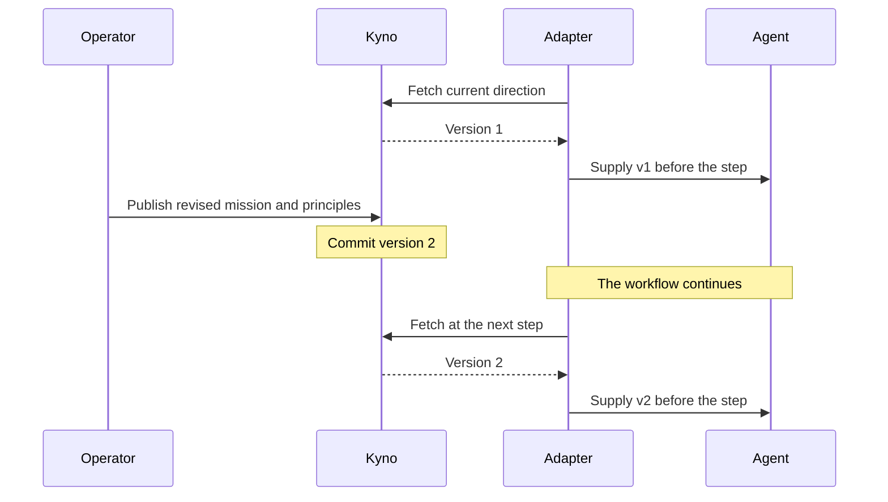

# Kyno

[](https://pypi.org/project/kyno/)
[](https://github.com/cizambra/kyno/actions/workflows/ci.yml)
[](https://pypi.org/project/kyno/)
[](https://github.com/cizambra/kyno/blob/main/LICENSE)
[](https://cizambra.github.io/kyno/)

**Kyno makes direction a first-class runtime primitive.** It gives running
agents a shared, versioned source of mission and principles. Direction has
its own identity, current version, history, and interface for retrieving it.

You publish direction to Kyno. Adapters fetch it and put it into the agent's
context before its next step. You can change direction while a workflow
continues; subsequent successful pulls receive the updated version.

Your framework still schedules tasks and runs agents. The model reasons
about what to do. Kyno supplies the direction that reasoning should use.


## When agents work toward the wrong goal

Suppose your sales agent is optimizing for new revenue. You change the
priority to retaining existing customers, but a running workflow still
carries the old instructions. The agent can execute its task correctly
while working toward yesterday's goal.

Even an up-to-date goal can leave important tradeoffs unstated. A goal
tells an agent what to optimize. Principles help it judge how:

```text
Mission: Build sustainable revenue by delivering real value customers willingly pay for.

Principles:
- Revenue follows value delivered.
- Never manufacture demand or consent.
- Protect long-term trust over short-term metrics.
```

The aim is to **optimize locally without losing coherence globally**.
An agent can make a locally reasonable choice that conflicts with broader
intent. Supplying that intent gives the model more information for its
judgment; it does not prove the judgment will be correct.

Agent systems already give tools, memory, reasoning, and execution their
own infrastructure. Direction is often copied into prompts, configuration,
repository files, or framework state. Those copies can become stale or
diverge as work moves between agents. Kyno gives them one authoritative
source to consult, whether direction changes or stays the same.

## A change during a run

Kyno calls a named mission and its ordered principles a *constitution*.
Each update appends an immutable version with a change note. An adapter
is the code that retrieves this direction and supplies it to an agent.



A decision boundary is the integration point before work proceeds: for
CrewAI, the hook before a model call; for LangGraph, the direction node
you place before a work node. The model does not have to remember to fetch
direction itself.

## Where Kyno fits

| Component | Responsibility |
| --- | --- |
| Permissions and security controls | Restrict the actions an agent may take. |
| Your framework | Schedule tasks, call tools, and run the workflow. |
| Memory | Retain information the system can use. |
| Kyno | Store, version, and deliver current mission and principles. |
| The model | Reason about the task and the supplied direction. |
| An optional verifier | Evaluate whether the output or action cohered with that direction. |

Kyno is a coherence control plane: its control is over the direction record
and access to it. It is not an orchestrator or a general AI governance
system. Boundaries constrain what agents may do. Kyno supplies the direction
they should use to decide what to do.

Model alignment concerns the values and behavioral tendencies developed
in a model. Kyno provides runtime organizational direction: the mission,
principles, and tradeoffs for this particular system, today. Your model
still needs that context even if it has been trained to behave safely.

## Quick start

```bash
pip install kyno
kyno new acme && cd acme  # the workspace: this instance's config and store
kyno db init
printf 'constitution: default\nmission: Ship a lending product people trust\n' > constitution.yaml
kyno apply constitution.yaml --note "initial constitution"
kyno current
export APP_TOKEN="$(kyno token add agents --scope read)"
kyno remote add --url http://127.0.0.1:2256/mcp --token-env APP_TOKEN
kyno serve --transport http
```

`kyno current` prints the direction and its version. The HTTP server serves
it over [MCP](https://modelcontextprotocol.io), a protocol for tools and
resources, and checks a bearer token on every request. The remote profile
records the URL and the name of your token variable, not its value.

Leave the server running. In another terminal, make the token available as
`APP_TOKEN` too, then run the Python example below. To mint a separate read
token for that terminal, run `export APP_TOKEN="$(kyno token add reader --scope read)"`
from the same workspace. Keep tokens out of source control.

```python
import kyno

with kyno.connect() as connection:
    direction = connection.binder().bind()
    print(direction.version, direction.mission)
```

This reads direction through the SDK without an agent framework. It uses
the default profile created above. You can also pass values the application
already owns: `kyno.connect(url=KYNO_URL, token=APP_TOKEN)`. The SDK does not
read `KYNO_URL` or `KYNO_TOKEN` by name.

## Use it from an agent framework

To connect CrewAI, install its extra in the same Python environment:

```bash
pip install "kyno[crewai]"
```

The adapter code is bundled with Kyno; the extra adds its framework
dependencies. You can install it after the base package, without
uninstalling Kyno. Then extend the Python example to register the hook:

```python
import kyno
from kyno.adapters.crewai import CrewAiKyno

with kyno.connect() as connection:
    binder = connection.binder()
    adapter = CrewAiKyno(binder)
    adapter.register()
    try:
        direction = binder.bind()
        print(direction.version, direction.mission)
    finally:
        adapter.unregister()
```

Run your existing crew inside the `try` block, while the connection and
hook are active. The example fetches direction without making a model call.

The CrewAI hook pulls before each model call and refreshes the direction
in its context.

For LangGraph instead, install its extra:

```bash
pip install "kyno[langgraph]"
```

Place a `direction_node` before each work node that needs a refresh; see
the [LangGraph integration](docs/adapters.md). If you use both frameworks
in one environment, install `pip install "kyno[crewai,langgraph]"`.
Each integration can select a different named constitution from the same
server. Shipped adapters are read-only and pull-only. They do not subscribe
to Core notifications.

If a pull fails, the default policy logs the failure and uses cached
direction, or empty version 0 if nothing has been fetched yet. Set
`PullPolicy(fail_closed=True)` on the binder to raise an error instead.
See [adapter failure policies](docs/adapters.md) before deploying.

## Could I do this with Git or a system prompt?

Yes. Git can store and review mission and principles, and a prompt or file
can be enough for a short workflow with fixed direction.

For a running system, you still need to decide which revision is active,
fetch it before work proceeds, refresh the agent's context, and record
which version was supplied. Kyno provides that shared runtime contract.
Direction has its own publication and retrieval operations, independent
of deploying workflow code.

You can author and review a constitution in Git, then publish it explicitly
with `kyno set`. Automatic Git synchronization is not part of the MVP.

## What Kyno does, and its limits

These describe the implemented behavior, not a promise about agent outcomes
or uninterrupted delivery. A failed pull follows the configured failure policy.

- Each named constitution has an authoritative current version and immutable history.
- Committed updates are available to subsequent reads without restarting the workflow.
- Integrated adapters pull at the boundaries where they are installed. A successful
  pull supplies the version current at the time of the read; failure follows the configured policy.
- Direction responses carry a version. Your integration can record it for each step.
- Authenticated HTTP access uses scoped, revocable tokens; remote writes record token attribution.

The supplied version tells you which direction the agent received. It does
not prove that the agent followed it. Kyno cannot guarantee correct
principle interpretation, prevent all drift, or establish that a system is safe.
New direction also does not rewrite an already-running task or replan a workflow.

An independent verifier such as [Canon](https://github.com/cizambra/canon)
can assess outputs against that direction. Kyno's optional realignment gate
consumes external verdicts; Kyno does not ship a judge. Verification and
hard execution boundaries complement direction delivery.

The architecture addresses stale and divergent direction copies. Claims
about improved agent behavior require benchmarks of the actual integration
and task; external alignment research alone does not establish Kyno's effectiveness.

- [The adapters in depth](docs/adapters.md): CrewAI, LangGraph, the
  failure postures, and the realignment gate.
- [Build your own adapter](docs/integrating.md): everything you need to
  build one, for any framework or language, with a conformance checker.

## What a constitution is

A constitution is a mission plus ordered principles. The mission is the
overarching purpose, and the tie-breaker when principles conflict. Both
can hold longer prose: a declaration under the mission, a description
under any principle.

The examples in this README read like strategy, but a constitution is
not limited to it. Operational principles are just as good a use case:
your quality bar, the tone you expect, or how you prioritize.

It is written in a file:

```yaml
# constitution.yaml
constitution: default
mission: Ship a lending product people trust with their worst month
principles:
  - Say the hard number first
  - title: Refuse clearly
    description: |
      If we cannot lend, we say so on the first screen, and we say why.
```

```bash
kyno apply constitution.yaml --note "the constitution as written"
```

The full file semantics, and running several constitutions side by side,
are in [Writing constitutions](docs/constitutions.md).

## Why versioning matters

Every change appends a new immutable version with a plain-language change
note. When your integration records the version supplied to a step, you
can retrieve that exact mission and principles later. Store history alone
does not tell you what an agent received, especially if a pull failed and
the adapter used a cached version.

## Self-hosting

Kyno self-hosts with no external services: SQLite out of the box,
PostgreSQL in production through the workspace's `[database]` section,
served over stdio for a
local process or over HTTP with a bearer token for a fleet. Tokens are
minted, listed and revoked at the database with `kyno token`, and
`kyno whoami --remote` asks a server which token it sees behind your
requests. A pip install ships with its own migration scripts. The
details live in [Operating Kyno](docs/operating.md).

## Documentation

The [documentation index](docs/README.md) lays these out in reading order.

- [Writing constitutions](docs/constitutions.md): the file, its fields,
  and multiple constitutions.
- [The MCP contract](docs/contract.md): every tool, the compact and full
  reads, and subscriptions.
- [The adapters in depth](docs/adapters.md): binder mechanics, failure
  postures, and the realignment gate.
- [Build your own adapter](docs/integrating.md): how to build an adapter
  in any language.
- [Publishing your constitution](docs/publishing.md): the public page,
  colors, and templates.
- [Operating Kyno](docs/operating.md): storage, auth, deploying, and testing.

## License

Two licenses, split by directory:

- The control plane (the server, store, CLI) is source-available under
  the [Elastic License 2.0](LICENSES/Elastic-2.0.txt).
- The SDK, the adapters, the conformance kit, and the integration guide
  are [MIT](LICENSES/MIT.txt).

[LICENSE](LICENSE) explains which license applies to each file.
You can build anything on the SDK, freely and commercially. What the
Elastic License restricts is offering the control plane itself as a
hosted service.

## Contributing

Issues and PRs welcome on [GitHub](https://github.com/cizambra/kyno/issues).
See [CONTRIBUTING.md](CONTRIBUTING.md) for style, test expectations, and
how licensing applies to new files.

Sibling project: [Canon](https://github.com/cizambra/canon) tests whether
your system's outputs actually cohere with the constitution Kyno serves.
