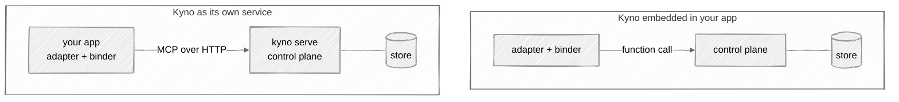

# The adapters in depth

The [project README](../README.md) shows the two-line integration. This
page is the detail underneath it. Building for another framework or
language? [integrating.md](integrating.md) walks you through it, stage
by stage.

On this page:

- [The loop](#the-loop)
- [The integration](#the-integration)
- [Inspecting delivery status](#inspecting-delivery-status)
- [Acting on a change](#acting-on-a-change)
- [The realignment gate](#the-realignment-gate)

## The loop

The loop is the cycle an adapter runs around every step: pull the
direction in force and put it in front of the agent. It's what keeps a
running system on the current version instead of on a copy. Everything
an adapter is expected to do falls out of these four behaviors.

- **Pull at execution boundaries.** The binder returns direction tagged
  with its constitution and version. CrewAI injects it into model messages;
  LangGraph puts it in state for your node to include in the model input.
  The default rendering includes the mission and principle titles;
  `connection.binder(context="full")` includes the declaration and
  principle descriptions too. If Kyno is unreachable, the step runs on
  the last direction the binder holds, and an event goes to the telemetry
  sink -- by default, a warning line in your logs naming the constitution
  and the version it fell back to. `PullPolicy(fail_closed=True)` makes
  the step raise instead.
- **What changed.** A pull includes the operator's change note and a
  computed delta: which principle moved, whether the mission moved, what
  was added or dropped. That's what makes a small change visible.
- **Planning.** `binder.plan()` returns a tracker: `direction()` pulls
  what to plan against, and `changed()` tells you when to re-plan the
  remaining work.
- **Adapters are read-only.** They pull. `set_direction` stays an
  operator action, never something an adapter calls on the crew's
  behalf.


## Inspecting delivery status

Custom integrations can use `binder.bind_with_status()` to distinguish a
successful read from fallback. It returns an immutable `DirectionBinding`
containing `direction` and a `DeliveryStatus` enum, both exported from
`kyno.sdk`:

```python
from kyno.sdk import DeliveryStatus

binding = binder.bind_with_status("customer-support")
if binding.status is DeliveryStatus.CACHED:
    print("Using retained direction", binding.direction.version)
block = binding.direction.render()
```

- `current`: this successful read confirmed the returned direction, even
  if its version did not change. It does not mean the version stays current
  after the read.
- `cached`: the binder retained a value after a pull failure, or kept a
  newer value when an older overlapping response arrived. This does not
  prove that the retained direction is obsolete.
- `empty`: the pull failed before any direction was cached. The direction
  is the existing empty version-0 fallback.

A successful read of an unwritten constitution is `current` at version 0.
If a later read fails, that cached version 0 is `cached`, not `empty`.
Fail-closed still raises `KynoUnavailableError` rather than returning a
binding. Unexpected programming errors still propagate.

Each result keeps its own status; later pulls cannot relabel it. The status
values serialize as lowercase strings. They describe the local binding,
not constitution content, and are not added to MCP payloads or injected
direction text. LangGraph exposes this status in graph state; CrewAI exposes
it through the optional `on_direction` callback.

`binder.bind()` continues to return only `Direction`. Both methods perform
one pull and use the same failure policy and telemetry.

## The integration

Choose the setup for your framework:

- [CrewAI integration](crewai.md): Kyno refreshes the model's messages
  through a before-call hook.
- [LangGraph integration](langgraph.md): Kyno populates graph state;
  your model-calling node includes that direction in the model's input.

For another framework or language, see [Building an adapter](integrating.md).

### Connection configuration

`kyno.connect()` resolves the default profile from `~/.kyno`. A named profile
uses `kyno.connect(profile="ops")`; an application that owns its wiring can use
`kyno.connect(url=endpoint, token=token)`. The SDK does not choose environment
variable names or read `KYNO_URL` and `KYNO_TOKEN` itself.

The adapter pulls from a running Kyno, and that Kyno can run in two
places. As its own service: `kyno serve` somewhere, `kyno.connect` from
your app. Or inside your Python application: you create Kyno's own
control plane object in your code and hand it to the binder with
`DirectionBinder(LocalDirectionSource(control_plane))`. In both cases
Kyno is running and holds the direction store; what changes is whether
a pull crosses the network or stays a function call. The embedded setup
is in [Operating Kyno](operating.md#running-kyno-embedded).

**Two ways to run Kyno: as its own service, or embedded in your app.**



## Acting on a change

Kyno delivers the direction, the version, and what changed. What your
system does when the version moves is an integration decision: you pick
the response when you wire the adapter, and each option has a cost and a
fit.

- **Carry on.** The next step gets the new direction, and finished work
  stands. This requires no extra planning or verification call beyond the
  direction boundary wired by your integration. It fits most workflows, where any
  step done under the current direction is good work.
- **Reassess.** Re-derive the remaining plan under the new direction.
  Wire it where your orchestrator plans: call `binder.plan()`, plan
  against `direction()`, and re-plan when `changed()` returns a fresh
  version. It costs one planning call per change, and it fits workflows
  whose remaining steps were derived from the direction, where following
  a stale plan wastes the rest of the run.
- **Stop.** Review finished work against the direction it was bound to,
  and halt on a bad verdict. Wire it with the
  [realignment gate](#the-realignment-gate) and a judge you supply. It
  costs a judge call per finished task, and it fits work that is
  expensive to ship wrong, where a halt is cheaper than a drifted
  handoff.

Kyno takes no position on which one is right, and they combine: most
integrations carry on by default and add the gate where the output is
expensive.

## The realignment gate

The gate reviews output at the boundary your integration chooses. It holds
no judgment of its own: it asks a `VerdictSource` you supply and returns a
decision. CrewAI handles halt decisions by raising from its task callback;
LangGraph can interrupt for a pause or return a blocked flag for your graph
to route on. Kyno ships no judge, and verification is optional.
Where a gate exists but its judge is unreachable, the work proceeds, and
an `unchecked` event goes to the telemetry sink -- by default, a warning
line in your logs. `GatePolicy(fail_closed=True)` stops instead.


See [CrewAI verification](crewai.md#optional-verification) or
[LangGraph verification](langgraph.md#optional-verification) for wiring.

## 💬 Questions?

[Ask one](https://github.com/cizambra/kyno/issues/new?template=question.yml)
and I'll answer there, so the next person finds it too.
