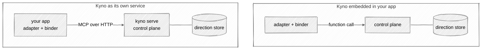
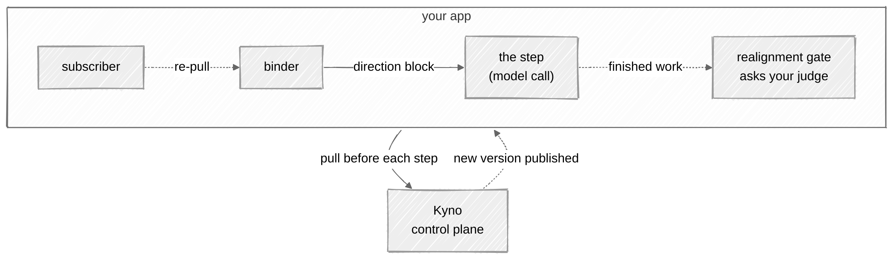

# The adapters in depth

The [project README](../README.md) shows the two-line integration. This
page is the detail underneath it. Building for another framework or
language? [integrating.md](integrating.md) walks you through it, stage
by stage.

On this page:

- [The integration](#the-integration)
- [The loop](#the-loop)
- [Acting on a change](#acting-on-a-change)
- [The realignment gate](#the-realignment-gate)


## The integration

```bash
pip install "kyno[crewai]"      # or: pip install "kyno[langgraph]"
```

On a different framework or language? [integrating.md](integrating.md)
shows how to build your own adapter.

An adapter binds a crew (in CrewAI) or a graph (in LangGraph) to one named constitution and re-binds
every next step to the version in force right now:

```python
import kyno
from kyno.adapters.crewai import CrewAiKyno

connection = kyno.connect()  # reads KYNO_URL and KYNO_TOKEN
adapter = CrewAiKyno(connection.binder(), constitution="eu")
adapter.register()  # injects the current direction before each model call
```

That's the whole integration. Every model call carries the version in force,
and a version published mid-run reaches the next step. The pieces behind
`connect()`, the binder, the sources, and the policies, live in `kyno.sdk` for
anyone who needs to assemble them differently.

The adapter pulls from a running Kyno, and that Kyno can run in two
places. As its own service: `kyno serve` somewhere, `kyno.connect` from
your app. Or inside your Python application: you create Kyno's own
control plane object in your code and hand it to the binder with
`DirectionBinder(LocalDirectionSource(control_plane))`. In both cases
Kyno is running and holds the direction store; what changes is whether
a pull crosses the network or stays a function call. The embedded setup
is in [Operating Kyno](operating.md#running-kyno-embedded).



### The loop

- **Pull before each step.** The binder injects the current mission and
  principle titles into the next model call, tagged with the constitution
  and version they came from. It stays small by default;
  `connection.binder(context="full")` injects the declaration and the
  principle descriptions too. If Kyno is unreachable, the step runs on
  the last direction the binder holds and the staleness shows up in
  telemetry; `PullPolicy(fail_closed=True)` makes the step raise instead.
- **Push when it changes.** `BackgroundSubscriber` turns a
  `resources/updated` notification into a re-pull. A running step is
  never interrupted; the next one binds the new direction.
- **What changed.** A pull carries the operator's change note and a
  computed delta: which principle moved, whether the mission moved, what
  was added or dropped. That's what makes a small change visible.
- **Planning.** `binder.plan()` returns a tracker: `direction()` pulls
  what to plan against, and `changed()` tells you when to re-plan the
  remaining work.
- **Adapters are read-only.** They pull and subscribe. `set_direction`
  stays an operator action, never something an adapter calls on the
  crew's behalf.



On LangGraph, inherit `KynoState` in your graph's state schema and put
`direction_node` ahead of the work. LangGraph carries only the keys a schema
declares, so without `KynoState` the direction a node pulls never reaches the
nodes after it:

```python
from kyno.adapters.langgraph import KynoState, direction_node


class State(KynoState, total=False):
    output: str
```

### Acting on a change

Kyno carries the direction, the version, and what changed. What a system does
when the version moves belongs to the system, and there are three answers:

- **Carry on.** The next step gets the new direction. The integration above
  already does this, and it costs nothing beyond the pull.
- **Reassess.** Re-derive the remaining work under the new direction. This
  is a planning call, made when `binder.plan()` reports a change.
- **Stop.** Review finished work against the direction it was bound to, and
  halt on a bad verdict. This is the realignment gate, and it costs a judge
  call per finished task.

Kyno takes no position on which one is right.

### The realignment gate

The gate reviews each finished task. It holds no judgment of
its own: it asks a `VerdictSource` you supply and acts on the answer, raising
on CrewAI and calling `interrupt()` on LangGraph when the verdict is
`DRIFTED`. Kyno ships no judge, so an adapter built without one has no gate.
Where a gate exists but its judge is unreachable, the work proceeds marked
`unchecked` and the event is emitted as telemetry;
`GatePolicy(fail_closed=True)` stops instead.

```python
from kyno.sdk import RealignmentGate
from kyno.adapters.langgraph import gate_node  # LangGraph

adapter = CrewAiKyno(binder, gate=RealignmentGate(source=your_judge))
crew = Crew(..., task_callback=adapter.task_callback)  # CrewAI
```
