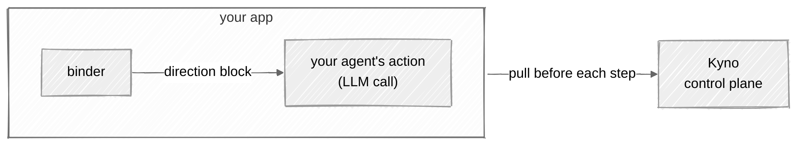
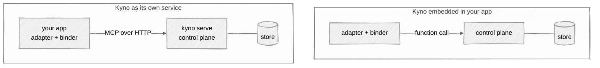
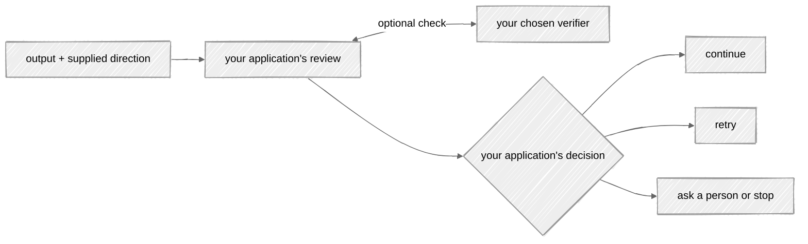

# The adapters in depth

The [project README](../README.md) shows the two-line integration. This
page is the detail underneath it. Building for another framework or
language? [integrating.md](integrating.md) walks you through it, stage
by stage.

On this page:

- [The loop](#the-loop)
- [The integration](#the-integration)
- [Inspecting delivery status](#inspecting-delivery-status)
- [Acting on a change](#acting-on-a-change)
- [Application-owned verification](#application-owned-verification)

## The loop

The loop is the cycle an adapter runs around every step: pull the
direction in force and put it in front of the agent. It's what keeps a
running system on the current version instead of on a copy. Everything
an adapter is expected to do falls out of these four behaviors.

- **Pull at execution boundaries.** The binder returns direction tagged
  with its constitution and version. CrewAI injects it into model messages;
  LangGraph puts it in state for your node to include in the model input.
  The default rendering includes the mission and principle titles;
  `connection.binder(context="full")` includes the declaration and
  principle descriptions too. If Kyno is unreachable, the step runs on
  the last direction the binder holds. The `kyno.sdk.binder` Python logger
  emits a warning naming the constitution, fallback version, and failure
  reason. `PullPolicy(fail_closed=True)` makes
  the step raise instead. Each binder keeps its own cached direction and
  recording receipt. Binders can share a connection without sharing their
  cache: a pull by one binder does not change another binder's fallback
  or last-seen version. A binder's context is fixed at construction and
  readable through `binder.context`. Create another binder to use a different
  context level; assigning to `binder.context` raises `AttributeError`.
- **What changed.** A pull includes the operator's change note and a
  computed delta: which principle moved, whether the mission moved, what
  was added or dropped. That's what makes a small change visible.
- **Planning.** `binder.plan()` returns a tracker: `direction()` pulls
  what to plan against, and `changed()` tells you when to re-plan the
  remaining work.
- **Adapters are read-only.** They pull. `set_direction` stays an
  operator action, never something an adapter calls on the crew's
  behalf.




## Inspecting delivery status

Applications own their model inputs, outputs, reasoning records, and execution
traces. Use whichever storage or tracing tools suit your application. Kyno's
delivery history records direction responses, not application execution.
When a binding has a recorded receipt, its `record_id` can link your records to
that response. The application must establish which output belongs to which
supplied direction; Kyno does not infer that association.

Custom direction sources return `DirectionResponse(changes, recording)` from
`changes_since()`. `changes` is the directional `ChangesSince` value; `recording`
is a separate immutable `RecordingReceipt` with the server's `RecordingStatus`
and nullable `record_id`. Local sources return `None` for recording. MCP sources
preserve `recorded`, `disabled`, and `failed` outcomes; missing recording information
remains `None`. These types are exported from `kyno.sdk`.

The result of `binder.bind_with_status()` includes `binding.recording`. It tells
you whether Kyno saved a delivery record for the read that supplied the returned
direction. When a record was saved, `binding.recording.record_id` identifies it.

- After a successful read, the result includes that read's recording status and
  record ID. Two reads can return the same direction version but have different
  record IDs: they are separate deliveries.
- If a read fails and the binder returns cached direction, it also returns the
  recording information saved with that direction. For example, if an earlier
  read returned version 3 with record ID `abc`, a later failed read returns the
  cached version 3 with record ID `abc`. That ID identifies the earlier delivery,
  not the failed attempt.
- If two reads overlap and the older version arrives last, the binder keeps the
  newer cached version and its recording information together.
- If no direction has been cached, a failed read returns empty direction with
  `recording=None`. Direction received without recording information also has
  `recording=None`.

Custom integrations can use `binder.bind_with_status()` to distinguish a
successful read from fallback. It returns an immutable `DirectionBinding`
containing `direction` and a `DeliveryStatus` enum, both exported from
`kyno.sdk`:

```python
from kyno.sdk import DeliveryStatus

binder = connection.binder("customer-support")
binding = binder.bind_with_status()
if binding.status is DeliveryStatus.CACHED:
    print("Using retained direction", binding.direction.version)
block = binding.direction.render()
```

- `current`: this successful read confirmed the returned direction, even
  if its version did not change. It does not mean the version stays current
  after the read.
- `cached`: the binder retained a value after a pull failure, or kept a
  newer value when an older overlapping response arrived. This does not
  prove that the retained direction is obsolete.
- `empty`: the pull failed before any direction was cached. The direction
  is the existing empty version-0 fallback.

A successful read of an unwritten constitution is `current` at version 0.
If a later read fails, that cached version 0 is `cached`, not `empty`.
Fail-closed still raises `KynoUnavailableError` rather than returning a
binding. Unexpected programming errors still propagate.

Each result keeps its own status; later pulls cannot relabel it. The status
values serialize as lowercase strings. They describe the local binding,
not constitution content, and are not added to MCP payloads or injected
direction text. LangGraph exposes this status in graph state; CrewAI exposes
it through the optional `on_direction` callback.

`binder.bind()` continues to return only `Direction`. Both methods perform
one pull and use the same failure policy and diagnostic logging.

## SDK diagnostic logs

The SDK uses Python's standard logging system. The `kyno.sdk.binder` logger
warns when a failed pull returns cached or empty direction. Your application
controls log levels, handlers, formatting, and destinations; the SDK does not
configure the root logger or install output handlers.

You can log returned bindings or delivery records using your application's
logger. Delivery history and diagnostic logs serve different purposes:
history records what Core served when recording is enabled, while SDK logs
report local failures and fallback even when no delivery record exists.

## The integration

### One binder reads one constitution

Select the constitution when creating a binder. It stays fixed for that
binder's lifetime; `bind()`, `bind_with_status()`, and `plan()` use that selection.
The default constitution is `"default"`.

```python
support = connection.binder("customer-support")
sales = connection.binder("sales")

support_direction = support.bind()
sales_direction = sales.bind()
```

These binders share the connection, not their last-seen versions, cached
direction, or recording receipts. Pass the chosen binder to your adapter or
call `support.plan()` to track plans against that same constitution.
`binder.constitution` is readable but cannot be reassigned.

Consumers can reuse a binder when they intend to share its last-seen version
and fallback. Each call still pulls; reuse does not deduplicate requests.

Choose the setup for your framework:

- [CrewAI integration](crewai.md): Kyno refreshes the model's messages
  through a before-call hook.
- [LangGraph integration](langgraph.md): Kyno populates graph state;
  your model-calling node includes that direction in the model's input.

For another framework or language, see [Building an adapter](integrating.md).

### Connection configuration

`kyno.connect()` resolves the default profile from `~/.kyno`. A named profile
uses `kyno.connect(profile="ops")`; an application that owns its wiring can use
`kyno.connect(url=endpoint, token=token)`. The SDK does not choose environment
variable names or read `KYNO_URL` and `KYNO_TOKEN` itself.

The adapter pulls from a running Kyno, and that Kyno can run in two
places. As its own service: `kyno serve` somewhere, `kyno.connect` from
your app. Or inside your Python application: you create Kyno's own
control plane object in your code and hand it to the binder with
`DirectionBinder(LocalDirectionSource(control_plane))`. In both cases
Kyno is running and holds the direction store; what changes is whether
a pull crosses the network or stays a function call. The embedded setup
is in [Operating Kyno](operating.md#running-kyno-embedded).

**Two ways to run Kyno: as its own service, or embedded in your app.**



## Acting on a change

Kyno delivers the direction, the version, and what changed. What your
system does when the version moves is an integration decision: you pick
the response when you wire the adapter, and each option has a cost and a
fit.

- **Carry on.** The next step gets the new direction, and finished work
  stands. This requires no extra planning or verification call beyond the
  direction boundary wired by your integration. It fits most workflows, where any
  step done under the current direction is good work.
- **Reassess.** Re-derive the remaining plan under the new direction.
  Wire it where your orchestrator plans: call `binder.plan()`, plan
  against `direction()`, and re-plan when `changed()` returns a fresh
  version. It costs one planning call per change, and it fits workflows
  whose remaining steps were derived from the direction, where following
  a stale plan wastes the rest of the run.
- **Review before continuing.** Your application can check finished work
  against its supplied direction, using its own checks or a verifier.
  It decides whether to continue, retry, or ask a person to review the
  answer. Put this check where sending an incorrect result would be costly;
  an external verifier adds a call at each review boundary.

Kyno takes no position on which one is right, and they combine: most
integrations carry on by default and add application-owned checks where the output is
expensive.

## Application-owned verification

Verification is optional application code that runs after the output is
available. Your application chooses the checks, calls any external verifier,
and decides what to do with the result. It also decides what happens when
verification fails or the verifier is unreachable.

Capture each output together with the direction supplied to that call.
Reading the binder's latest cache after a call finishes can select direction
from a later call, especially during parallel work. If a recording receipt
is available, save its `record_id` with your application record to link it
to Core's direction response. Core's record does not establish that the
output followed that direction.

`PullPolicy(fail_closed=True)` controls failed direction reads before work
runs. Output review and its failure policy belong to your application.



See [CrewAI verification](crewai.md#optional-verification) or
[LangGraph verification](langgraph.md#optional-verification) for concrete examples.

## 💬 Questions?

[Ask one](https://github.com/cizambra/kyno/issues/new?template=question.yml)
and I'll answer there, so the next person finds it too.
