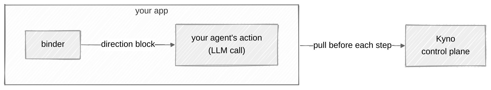
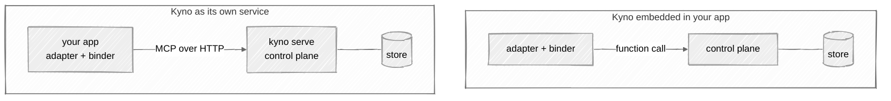
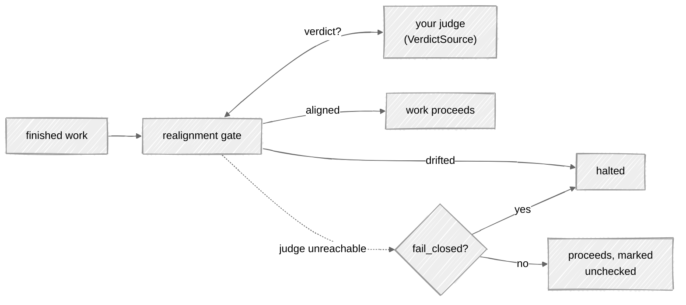

# The adapters in depth

The [project README](../README.md) shows the two-line integration. This
page is the detail underneath it. Building for another framework or
language? [integrating.md](integrating.md) walks you through it, stage
by stage.

On this page:

- [The loop](#the-loop)
- [The integration](#the-integration)
- [Acting on a change](#acting-on-a-change)
- [The realignment gate](#the-realignment-gate)

## The loop

The loop is the cycle an adapter runs around every step: pull the
direction in force and put it in front of the agent. It's what keeps a
running system on the current version instead of on a copy. Everything
an adapter is expected to do falls out of these four behaviors.

- **Pull before each step.** The binder injects the current mission and
  principle titles into the next model call, tagged with the constitution
  and version they came from. It stays small by default;
  `connection.binder(context="full")` injects the declaration and the
  principle descriptions too. If Kyno is unreachable, the step runs on
  the last direction the binder holds, and an event goes to the telemetry
  sink -- by default, a warning line in your logs naming the constitution
  and the version it fell back to. `PullPolicy(fail_closed=True)` makes
  the step raise instead.
- **What changed.** A pull includes the operator's change note and a
  computed delta: which principle moved, whether the mission moved, what
  was added or dropped. That's what makes a small change visible.
- **Planning.** `binder.plan()` returns a tracker: `direction()` pulls
  what to plan against, and `changed()` tells you when to re-plan the
  remaining work.
- **Adapters are read-only.** They pull. `set_direction` stays an
  operator action, never something an adapter calls on the crew's
  behalf.




## Inspecting delivery status

Custom integrations can use `binder.bind_with_status()` to distinguish a
successful read from fallback. It returns an immutable `DirectionBinding`
containing `direction` and a `DeliveryStatus` enum, both exported from
`kyno.sdk`:

```python
from kyno.sdk import DeliveryStatus

binding = binder.bind_with_status("customer-support")
if binding.status is DeliveryStatus.CACHED:
    print("Using retained direction", binding.direction.version)
block = binding.direction.render()
```

- `current`: this successful read confirmed the returned direction, even
  if its version did not change. It does not mean the version stays current
  after the read.
- `cached`: the binder retained a value after a pull failure, or kept a
  newer value when an older overlapping response arrived. This does not
  prove that the retained direction is obsolete.
- `empty`: the pull failed before any direction was cached. The direction
  is the existing empty version-0 fallback.

A successful read of an unwritten constitution is `current` at version 0.
If a later read fails, that cached version 0 is `cached`, not `empty`.
Fail-closed still raises `KynoUnavailableError` rather than returning a
binding. Unexpected programming errors still propagate.

Each result keeps its own status; later pulls cannot relabel it. The status
values serialize as lowercase strings. They describe the local binding,
not constitution content, and are not added to MCP payloads or injected
direction text. LangGraph exposes this status in graph state. CrewAI does
not yet expose it through a callback.

`binder.bind()` continues to return only `Direction`. Both methods perform
one pull and use the same failure policy and telemetry.

## The integration

```bash
pip install "kyno[crewai]"      # or: pip install "kyno[langgraph]"
```

On a different framework or language? [integrating.md](integrating.md)
shows how to build your own adapter.

An adapter binds a crew (in CrewAI) or a graph (in LangGraph) to one named constitution and re-binds
every next step to the version in force right now:

```python
import kyno
from kyno.adapters.crewai import CrewAiKyno

connection = kyno.connect()  # uses the default profile from ~/.kyno
adapter = CrewAiKyno(connection.binder(), constitution="eu")
adapter.register()  # injects the current direction before each model call
```

`kyno.connect()` resolves the default profile from `~/.kyno`. A named profile
uses `kyno.connect(profile="ops")`; an application that owns its wiring can use
`kyno.connect(url=endpoint, token=token)`. The SDK does not choose environment
variable names or read `KYNO_URL` and `KYNO_TOKEN` itself.

That's the whole integration. Every model call runs under the version in force,
and a version published mid-run reaches the next step. The pieces behind
`connect()`, the binder, the sources, and the policies, live in `kyno.sdk` for
anyone who needs to assemble them differently.

The adapter pulls from a running Kyno, and that Kyno can run in two
places. As its own service: `kyno serve` somewhere, `kyno.connect` from
your app. Or inside your Python application: you create Kyno's own
control plane object in your code and hand it to the binder with
`DirectionBinder(LocalDirectionSource(control_plane))`. In both cases
Kyno is running and holds the direction store; what changes is whether
a pull crosses the network or stays a function call. The embedded setup
is in [Operating Kyno](operating.md#running-kyno-embedded).

**Two ways to run Kyno: as its own service, or embedded in your app.**



### LangGraph: required integration

Kyno supplies `KynoState`, `direction_node`, and `pull_before`. You supply
the graph and the node that calls your model.

1. Inherit `KynoState` in your graph's state schema. LangGraph only carries
   keys declared by that schema.
2. Wrap your model-calling node with `pull_before`, or place a
   `direction_node` before it in the graph. Choose one boundary; using both
   there would pull twice.
3. Include `state["kyno_direction"]` in the model's input. The adapter
   populates graph state; it does not modify your model's messages for you.

With a binder from `connection.binder()` and your configured chat model,
the node can look like this:

```python
from kyno.adapters.langgraph import KynoState, pull_before


class State(KynoState, total=False):
    messages: list[dict]
    output: str


@pull_before(binder, constitution="customer-support")
def answer(state):
    messages = [
        {"role": "system", "content": state["kyno_direction"]},
        *state["messages"],
    ]
    return {"output": model.invoke(messages).content}
```

`answer` is an example name for your own graph node, not a Kyno function
to implement or override. Decorate your existing node and register it in
your graph as usual. `model` is your application's model client.

The decorator pulls once before the node runs, applies the binder's
failure policy, and supplies direction and delivery metadata in state.
You do not need to implement those steps yourself. You also do not need
receipt storage, run IDs, or step IDs for this integration to work.

### LangGraph: delivery metadata provided by Kyno

`direction_node` and `pull_before` write `kyno_delivery_status` alongside
the existing constitution, version, and rendered `kyno_direction` block.
The status is a lowercase string in state and checkpoints: `current`,
`cached`, or `empty`, with the meanings described above. Compare it with
`DeliveryStatus` values, or convert it with `DeliveryStatus(value)` when
you need an enum. A missing key or `None` means unknown, not `current`.
Calling `direction_update(direction)` without binding status writes `None`
so it cannot preserve a status from an earlier binding.

If you configure a LangGraph checkpointer, these declared state keys are
saved with the graph's other state. Kyno does not configure checkpoint
storage for you. Checkpointing is optional for consuming direction.

A direction node before a fan-out supplies the same snapshot to its branches.
Later pulls do not change earlier receipts. Resuming a checkpoint without
another pull preserves the original delivery status; it does not establish
that the saved version is still current. Work nodes should leave the
`kyno_` direction keys unchanged so the checkpoint describes their input.

### LangGraph: optional per-step receipt recording

Only add this if your application needs a separate record of the direction
supplied to each model call. It is not required by the adapter.

Record the state received by the work node, not the binder's latest cached
value. Use `kyno_direction` directly: it contains the exact rendered block,
including any change notes and delta. Rebuilding it with
`direction_from_state()` loses that change context.

For example, insert this inside your node after constructing the model's
messages and before calling the model:

```python
record_receipt(
    run_id=state["run_id"],
    step_id=state["step_id"],
    constitution=state["kyno_constitution"],
    version=state["kyno_version"],
    status=state["kyno_delivery_status"],
    context=state["kyno_context"],
    direction=state["kyno_direction"],
)
```

`record_receipt` is an application-defined function, not a Kyno API.
If you choose this extension, provide that function, declare `run_id` and
`step_id` in your state schema, and assign a unique step ID within each
run. Store receipts only where you intend to retain potentially
sensitive direction. A receipt records supplied context, not a completed
model call or evidence that the model followed it.

### Acting on a change

Kyno delivers the direction, the version, and what changed. What your
system does when the version moves is an integration decision: you pick
the response when you wire the adapter, and each option has a cost and a
fit.

- **Carry on.** The next step gets the new direction, and finished work
  stands. This is the default; `adapter.register()` already does it, and
  it costs nothing beyond the pull. It fits most workflows, where any
  step done under the current direction is good work.
- **Reassess.** Re-derive the remaining plan under the new direction.
  Wire it where your orchestrator plans: call `binder.plan()`, plan
  against `direction()`, and re-plan when `changed()` returns a fresh
  version. It costs one planning call per change, and it fits workflows
  whose remaining steps were derived from the direction, where following
  a stale plan wastes the rest of the run.
- **Stop.** Review finished work against the direction it was bound to,
  and halt on a bad verdict. Wire it with the
  [realignment gate](#the-realignment-gate) and a judge you supply. It
  costs a judge call per finished task, and it fits work that is
  expensive to ship wrong, where a halt is cheaper than a drifted
  handoff.

Kyno takes no position on which one is right, and they combine: most
integrations carry on by default and add the gate where the output is
expensive.

### The realignment gate

The gate reviews each finished task. It holds no judgment of
its own: it asks a `VerdictSource` you supply and acts on the answer, raising
on CrewAI and calling `interrupt()` on LangGraph when the verdict is
`DRIFTED`. Kyno ships no judge, so an adapter built without one has no gate.
Where a gate exists but its judge is unreachable, the work proceeds, and
an `unchecked` event goes to the telemetry sink -- by default, a warning
line in your logs. `GatePolicy(fail_closed=True)` stops instead.



```python
from kyno.sdk import RealignmentGate
from kyno.adapters.langgraph import gate_node  # LangGraph

adapter = CrewAiKyno(binder, gate=RealignmentGate(source=your_judge))
crew = Crew(..., task_callback=adapter.task_callback)  # CrewAI
```

## 💬 Questions?

[Ask one](https://github.com/cizambra/kyno/issues/new?template=question.yml)
and I'll answer there, so the next person finds it too.
