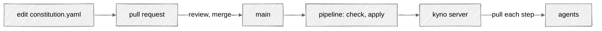

# Best practices

How to run Kyno once real agents depend on the store. Everything on this
page uses what ships today, and the sequence scales down: solo you are
every role, in a team the roles split. Take the rungs in order and stop
where your team is.

## Keep the constitution in version control

The store serves direction; version control explains it. Keep the file
in a repo, change it by pull request, and let the PR be the approval: what merged is
what a reviewer read, and the version's note names the commit. Keep the
PR as evidence of review alongside Kyno's version history. The approval
method recorded by Kyno is client-reported, not proof that review occurred.



## One writer

Grow toward the pipeline being the only thing that applies. People edit,
review, and read; CI writes. Give agent applications read-only credentials
and keep the writer's credentials in a separate environment. See
[who should hold write access](operating.md#who-should-hold-write-access)
for scope limits and the difference between approval and attribution.

On day one you'll apply from a laptop, and
that's fine — remote mode asks you the [consent
question](operating.md#3-go-remote) precisely because there's no
reviewer between you and production. That question is a CLI safeguard,
not server-enforced approval. The day CI takes over,
applying by hand becomes the exception that stands out in the direction history.

## The CI recipe

Two commands. First ask: is the store where this merge assumed it was?
Compare against the parent commit's file, not your own — differing from
your own file is normal right before an apply. The commands are git's;
any VCS works, all you need is the file as it was at the parent
revision.

```bash
git show HEAD^:constitution.yaml > /tmp/parent.yaml
kyno check /tmp/parent.yaml --remote   # agree = safe, differ = fail
kyno apply constitution.yaml --remote --no-interactive --note "$(git log -1 --pretty=%s)"
```

If the store matches the parent, nothing landed that your file misses:
apply. If it differs, something did — a sibling job or an unmerged hotfix
— and applying would revert it, so the job fails and someone reconciles.
`no field changed` is a clean exit, so reruns and already-applied merges
need no special case. Pass `--no-interactive` explicitly: some runners
fake a terminal, and a question that hangs a job is worse than one that
fails it.

## Rehearse before you apply

Nobody can compute what agents will do differently under a reworded
principle. So don't predict — rehearse. Apply the draft to a staging name
(`hiring-next` beside `hiring`), point a test crew or an eval at it, and
watch. Promotion is applying the same reviewed file to the real name.

## Revert, don't roll back

Want v3 back? Apply v3's content again and you get, say, v10 with v3's
content. History keeps everything, including the mistake. Recovery is
never retyping: `kyno current --yaml` reads any head back out as a file.

## When the repo and the store disagree

Two copies fall out of sync in exactly two ways, and each repair is one
command:

- **Merged, forgot to apply.** The store falls behind; agents serve old
  direction while the repo looks done. Apply main's file — the CI recipe
  above makes this structural, because merging is applying.
- **Applied, forgot to merge.** The store runs ahead; live direction has
  no reviewed home, and the next merge would silently revert it. The next
  `check --remote` against main fails, printing which fields differ. To keep the change:
  `kyno current --yaml > constitution.yaml`, commit, review, merge. To
  discard it: apply main's file — the delta says it reverts, and this
  time that's the point.

## Secrets stay references

`config/server` takes any value written in; Kyno forces nothing. The
practice is to write secrets only as `${VAR}` references.
`password = ${DB_PASSWORD}` commits safely — `password = hunter2` is one
push away from being public. A workspace that holds only references can
live in git and mount on any host, and the secrets travel through your
platform's secret store instead of through the repo.

## Read the ledger

`kyno history` is one line per version: the client-reported author, when,
the client-reported approval method (`operator`, `automation`, or `override`),
and the note. In a healthy setup almost every line is the
pipeline's. A version somebody applied by hand is not an error — it's a
line that should have a story.
