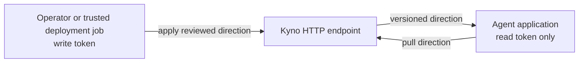

# Operating Kyno

Storage, auth, deployment, and testing for a production Kyno.

On this page:

- [The workspace](#the-workspace)
- [Storage](#storage)
- [Running Kyno embedded](#running-kyno-embedded)
- [Auth](#auth)
- [Who should hold write access](#who-should-hold-write-access)
- [Deploying](#deploying)
- [Testing](#testing)


## The workspace

A workspace is a directory that defines one Kyno instance. `kyno new`
creates it; the argument is the name of the directory to create, so pick
any name you like. Every command that needs the store finds the
workspace by walking up from the current directory, the way git does.

```console
$ kyno new my-instance
$ cd my-instance && kyno db init
$ kyno serve --transport http
$ kyno token add agents --scope read     # in another terminal
```

The endpoint checks a bearer token on every request: until one
exists, every request is refused, and a token minted while the server
runs works on the next request. Details in [Auth](#auth).

`kyno new` writes four files:

```
my-instance/
  README.md          what this directory is
  .gitignore         keeps the SQLite store out of git
  config/server      the instance's configuration
  db/.keep           where the SQLite store will live
```

Two directories, two owners:

- `~/.kyno` holds what belongs to a person: credentials and remotes. It
  never ships with a deploy.
- The workspace holds what belongs to the instance: the `config/server`
  file and, on SQLite, the store under `db/`.

The rules for the `config/server` file:

- A value is written in, or is one `${VAR}` reference to an environment
  variable you named. References resolve at startup; an unset variable
  fails startup and the error names the variable.
- Kyno never requires a reference: a password written in works. When to
  keep secrets as references is a practice call — see
  [Best practices](best-practices.md#secrets-stay-references).
- An unknown key or section fails startup and names the typo.

The `[database]` section describes the database with split keys, like
Rails' `database.yml`. In this example everything is written in except
the password, which comes from a variable:

```ini
[database]
adapter = postgresql
host = db.internal
database = kyno
username = kyno
password = ${DB_PASSWORD}
```

- The default, as `kyno new` writes it: `adapter = sqlite3` with the
  store at `db/kyno.sqlite3`. SQLite can run production on a single
  box.
- A platform that hands you one connection string uses
  `url = ${DATABASE_URL}` instead. `url` beside the split keys is
  refused.

## Storage

SQLite, PostgreSQL and MySQL, declared in the workspace's `[database]`
section. Which engine runs where is the operator's call: SQLite is enough for
production on a single box, and Postgres or MySQL are equally fine for
local development. If you want postgres or mysql, you need to install
the adapter first:

```console
$ pip install kyno[postgres]
$ pip install kyno[mysql]     # MariaDB uses this one too
```
Storage is pluggable: hand `SqlConstitutionStore` your own SQLAlchemy
`Engine` to live inside an existing database, or implement the small store
protocol to bring your own persistence entirely. Concurrent writers are safe:
versions are serialized by a unique index and a retry, never lost or
duplicated.

Reads never fail on an empty store. Before any direction is set, consumers
get a version-0 empty state, so integrating Kyno ahead of adopting it costs
nothing.

## Recording direction served over MCP

Delivery history lets an application retrieve the direction associated with earlier
work, even after the current constitution changes. The application can pass that
snapshot and its own output to a verifier. Kyno does not call the verifier or decide
what to do with its assessment.

Recording is off by default. To enable it, add this setting under the existing
`[server]` section in `config/server`, run `kyno db upgrade`, and restart the server:

```ini
[server]
recording_policy = always
```

The choices are `always` and `never`. Core controls this setting; adapters and MCP
requests cannot override it. `always` attempts to record each successful runtime
direction response, including repeated reads of the same version. `never` stops
new recording without deleting existing records or disabling operational and
security logging. Earlier unrecorded requests cannot be reconstructed.

The covered operations are `get_constitution`, `get_changes_since`, `get_mission`,
`get_declaration`, `get_principles`, `get_principle`, and the current-constitution
MCP resource. Exports, public pages, and delivery-history queries are not recorded
as runtime deliveries. Direct embedded reads are not covered by this MCP integration.

Runtime tool calls accept an optional `session_id` and JSON `metadata` object.
The application decides what the session represents. Metadata can hold experiment
or application request IDs; it must not contain credentials, prompts, or outputs.
Session labels are limited to 255 characters and encoded metadata to 16,384 bytes.
Authenticated identity comes from the token, not these caller-supplied fields.

The direction response includes a separate `recording` object:

| Status | Delivery ID | Meaning |
| --- | --- | --- |
| `recorded` | Present | Core confirmed that the response was saved. |
| `disabled` | `null` | Recording is off; no history write was attempted. |
| `failed` | `null` | Direction was returned, but persistence was not confirmed. |

`disabled` and `failed` describe the response; they do not create placeholder
database records. Recording failures generate an operational warning without
including the direction payload or database error message.

Use the returned ID with the MCP tool `get_delivery`, passing
`{"delivery_id": "the-returned-id"}`. The result contains the exact directional
payload, version, operation, timestamp, session context, and authenticated requester.
A targeted principle read records only that principle; it does not claim a full
constitution was served. `get_changes_since` retains its notes and delta.

`list_deliveries` accepts `session_id`, `constitution`, inclusive `since`/`until`
timezone-aware ISO timestamps, `limit` (1–100, default 50), and `after` (a cursor).
Results are in insertion order. Pass `next_cursor` as `after` with the same filters
to fetch another page; `null` means there is no further page at that moment. Pages
are live queries, not a frozen snapshot across concurrent writers.

Both history tools use the existing `read` scope. As with other MCP reads, that
scope applies across the instance: readers can see session metadata for all its
constitutions. A delivery ID alone grants no access. History has no public-page
representation or client update/delete operation.

Keep the delivery ID with the application's output so a later review retrieves
the right direction instead of the latest version. When recording is disabled or
fails, the application needs its own direction snapshot if it wants that evidence.
A server record does not confirm prompt injection, model obedience, or even client
receipt after a network interruption. Cache-only work creates no new server record.

There is no automatic expiration or pruning in this version. Enabling recording
grows database storage. Recording currently uses synchronous database operations;
database connection and lock timeouts therefore matter to request latency.

## Running Kyno embedded

When your orchestrator is itself a Python app, you can run the control
plane inside it instead of behind `kyno serve`. The construction mirrors
what the CLI does: read the settings, build the store, and hand the
control plane to the binder.

```python
from kyno.server_config import Settings, store_from_settings
from kyno.service import ControlPlane
from kyno.sdk import DirectionBinder, LocalDirectionSource

store = store_from_settings(Settings.load())  # finds the workspace at or above cwd
control_plane = ControlPlane(store)
binder = DirectionBinder(LocalDirectionSource(control_plane))
```

The schema has to exist before the first read, so run `kyno db init` once
against the same database, or call `store.create_all()` from code. From
here the binder behaves exactly as it does over MCP, and the CLI keeps
working against the same database for edits and inspection.

## Auth

- **stdio** is open. A process that can spawn the server already owns the
  database file under it, so a token there would add a step without adding
  protection.
- **HTTP** is gated by the token inventory. Every request to the MCP
  endpoint (`/mcp`) must carry a live minted token as its bearer; the
  server hashes what arrived and looks it up. Unknown, revoked and expired
  all get the same 401, so a caller cannot use the response to find out
  which tokens exist. A `read` token can call every tool except
  `set_direction`; `set_direction` needs `write` and answers 403
  otherwise. Every tool declares the scope it needs, and a tool the
  server does not declare is refused for every token: a new tool is
  unreachable until someone states what it requires. A server with no live tokens still
  starts: it refuses every /mcp request until one is minted, and a note
  on stderr at startup says that is what will happen and names the
  command that mints one. You can start the server first and mint
  tokens later. The endpoint checks the database on every request, so a
  token minted while the server runs works on the next request, with no
  restart. To turn the check off entirely, set `allow_insecure = true`
  in `config/server`. That opens the endpoint to anyone who can reach
  it, so it is for local experimentation only, and the server prints a
  warning at startup saying exactly that: it is serving without token
  checks, and the constitution can be rewritten by anyone who can reach
  the endpoint. Embedders building the app in
  code pass their store — `build_http_app(cp, token_store=store)` — or opt in
  the same way:
  `build_http_app(cp, allow_insecure=True)`. The published constitution
  pages above sit outside that gate on purpose; they are the surface you
  chose to open.

A write token is direction control: whoever holds it steers the
direction available to agents consuming the constitutions they change. Treat it like a system-prompt
credential: serve `/mcp` over TLS and keep the token out of logs and
checkpoints (Kyno's own reprs never print it). One related caution: the
`[kyno:direction …]` header on the injected block is a record for reading
transcripts, not a security check. Text arriving from tools or users can
imitate it, so nothing should trust a block just for looking like one. Kyno
refuses constitution text containing the marker, and the adapters only ever
replace the block they injected themselves.

### Who should hold write access

Give agent applications **read-only tokens**. Keep write tokens in a
separate operator environment or trusted deployment job. An agent needs
to receive direction, not permission to rewrite it.

The distinction is about credentials and process access, not just which
tools you show the model. Shipped adapters only pull, but an application
holding a write token can call `set_direction` directly. Removing that
tool from the agent's tool list does not reduce the token's authority.



These are separate credential environments. Do not give the agent process
access to the operator's write token, credentials file, or database
credentials. Do not put write credentials in prompts, tool results, logs,
saved workflow state, or direction receipts. A variable reference avoids
copying the secret into configuration; it does not protect the secret
from a process that can read the referenced environment variable.

#### What the permissions cover

Token scopes apply across the server, not to individual constitution
names. A read token can read any constitution available through that
server's MCP tools. A write token can also change any of those
constitutions. Selecting `constitution="customer-support"` in an adapter
chooses what it reads; it is not an access restriction.

Do not use constitution names as a privacy boundary between teams or
customers. Where separate access boundaries are required, use separately
isolated deployments and credentials. Deliberately published constitution
pages remain public regardless of token scope.

HTTP token checks do not protect direct database access. Local CLI
commands, an embedded control plane, and stdio operate with the access
of their host process. Keep workspace and database access outside the
agent environment if HTTP read scope is the boundary you rely on.
`allow_insecure = true` removes the HTTP token boundary entirely.

#### Approval and attribution are different

Authentication establishes which live credential a request used and
whether its scope permits the tool. It does not establish that the new
mission or principles are sensible, safe, or reviewed.

The remote CLI's confirmation questions help an operator review an
apply. They are not a server-enforced approval workflow. Another client
with a write token can call `set_direction` without answering them.
Review requirements belong in the surrounding deployment process and
in who can obtain its write credentials.

Read version attribution with these limits in mind:

| Field | What it records | What it does not prove |
| --- | --- | --- |
| `created_by` | The actor name supplied by the client. | The identity of the person who made the request. |
| `authorized_by` | The client's reported approval method: `operator`, `automation`, or `override`. | That a human approved the change or a trusted pipeline performed it. |
| `token_id` | For an authenticated HTTP write, the credential verified by the server. | Who physically used that credential or whether its holder was authorized by your organization to make this particular change. |

Local writes have no authenticated HTTP token identity. Keep external
review or deployment records if you need evidence of approval, and use
separate credentials for independently operated writers so their requests
can be distinguished.

Revoking a token stops subsequent authenticated requests using it. It
does not remove direction already cached by agents, cancel running work,
or undo completed actions. A read failure may still use cached direction
under the application's [configured failure policy](adapters.md#inspecting-delivery-status).

### Minting and revoking tokens

The store keeps a token inventory in its own table, managed from the
workspace:

```bash
kyno token add ci --scope write               # prints the value, once
kyno token add hotfix --scope write --ttl 2h  # expires on its own
kyno token list                               # live tokens
kyno token list --all                         # revoked and expired included
kyno token revoke ci
kyno token revoke --id 3                      # when two live tokens share a name
```

The rules, one at a time:

- `--scope` is required; there is no default. `read` allows every tool
  except `set_direction`; `write` allows everything.
- The value is printed once, at minting, and starts with `kyno_` so a
  leaked one is recognizable, by people and by secret scanners. Only its
  sha256 is stored: steal the database and you hold hashes, and a hash
  does not work as a token.
- Names are labels, not identities. Two live tokens share a name during
  rotation on purpose, and commands ask for `--id` when a name is
  ambiguous.
- Rows are never deleted. Revoking sets a timestamp on the row, and
  `revoke` acts on live tokens only: a token that already expired is
  refused, so the row keeps showing how it died.
- The `token` commands are local, like `kyno db init`: they talk straight
  to the workspace's database. There is no way to mint over the network --
  if a stolen write token could mint, it could mint itself a spare before
  you revoke it.

On every authenticated request, the server writes one log line per tool
call — the token id and name, the tool, and the constitution. That log is
the request history: read it to know which tokens were active in a time
window.

A remote write also records the token on the version it appends. Three
fields say three different things about a version, and only the last one
is checked by the server: `created_by` is the actor the client claimed,
`authorized_by` is how the client says the apply was approved (`operator`,
`automation` or `override`), and the token id is the credential the server itself
verified from the request. A local apply has no token, so that field
stays empty.

The token's `last_used_at` is also updated, at most once every five
minutes, so `kyno token list` can answer whether a token is still in use
without a database write per request. The stored time can run up to five
minutes behind the real last use, never ahead; for exact times, read the
log.

## Remote mode

Locally, `kyno` talks straight to a store file on your disk. Remote mode points the same commands at a Kyno server instead: you operate production from your laptop or a pipeline, and nobody holds database credentials. Setting it up consists in three steps: save a token, name a destination, and go remote with the commands you already know.

### 1. Save a token

Each credentials profile holds one token. The token itself never goes on the command line, because command lines end up in shell history:

```bash
kyno credentials add --token-env KYNO_TOKEN                   # profile "default"
kyno credentials add --profile oncall --token-env KYNO_ONCALL # a second identity
kyno credentials add --profile laptop                         # no flag: asks for it, hidden
```

`--token-env` stores a reference (`${KYNO_TOKEN}`), read each time you use the profile — so rotating the token is just changing the variable's value. Without it, the token you type is written into the file, and the file is readable only by you.

`kyno credentials list` prints the profiles this machine holds, one line each. Token values never print: a stored token shows as `stored token`, and a profile that reads a variable shows the variable's name and whether it is set right now.

Everything lands in small files under `~/.kyno`, the same path on every machine, written only by these commands. They never live next to a repo, so a credentials file can't end up in a commit by mistake.

### 2. Name a destination

Each remote profile is one destination: the URL, and where its token comes from.

```bash
kyno remote add --url https://kyno.mybiz.com                          # "default", on the default credentials
kyno remote add --url https://kyno.mybiz.com --profile oncall --credentials oncall
kyno remote add --url https://kyno.mybiz.com --profile ci --token-env KYNO_TOKEN
```

Pointing at credentials that don't exist fails right there, and the error tells you what you do have and what to run. The `--token-env` form skips the credentials file entirely — right for a CI image that carries no credentials at all.

A profile has exactly one token source. Several profiles can share one credential (three regional servers, one operator token), but one profile never holds two tokens — Kyno would be picking between them silently, and "who wrote this" would become a guess. To act as someone else on the same server, make a second profile with the same URL and different credentials; a production write then visibly says which profile it used.

### 3. Go remote

One flag, on the commands you already use:

```bash
kyno current --remote
kyno get-version 2 --remote --yaml
kyno apply constitution.yaml --note "sharpen the mission" --remote
kyno check constitution.yaml --remote
kyno history --remote
kyno export --remote
kyno whoami --remote
```

They work against the profile's endpoint instead of your local store and print exactly what their local versions print. `--profile oncall` picks a different remote profile; `--credentials` or `--token-env` beside it swaps the token source for that one run. Without `--remote` you are always on your local store — there is no fallback in either direction.

When you run a remote `apply` from a terminal, Kyno asks a question after showing the delta: have you evaluated this change against your workflow? The default answer is no, and if the answer is no, nothing is applied. If the file has the same content as an older version, Kyno also asks whether this is a deliberate revert, to catch applies from stale files.

Two flags skip the questions, with two different meanings, and you pass at most one:

| flags | questions | meaning |
|---|---|---|
| none (terminal) | asked | a person answered |
| `--no-interactive` | skipped | nobody was there; the checks are the protection |
| `--unsafe-approval` | skipped, yes to all | approved blind, on purpose |

`--no-interactive` is the CI lane: the yes already happened in review, and the version pin plus the `check` step do the guarding. `--unsafe-approval` is for overriding on purpose, and it stands out in review by design.

Who stood behind an apply is recorded on the version it writes as `authorized_by` — `operator`, `automation`, or `override` — and `kyno history` prints it. It's written at write time because it can't be reconstructed later. Local applies record nothing: there were no questions to answer.

Two behaviors worth knowing. A remote `apply` fetches the server's head and shows you the same delta a local apply shows, before it applies; a duplicate apply is the same clean no-op. And a server you can't reach is a plain one-line error — except under `check`, which still prints its field-by-field report and ends with a comparison line saying the store was not compared, and why.

`check` exits 0 only when the file matches the current direction. It exits 1 when direction differs, the constitution has no versions, or the comparison fails, including an unreachable local store or remote server. The field report still prints when the comparison fails.

### Checking your wiring

A profile is a pointer to a pointer: the remote points at credentials, the credentials point at a variable, the variable holds the token. `kyno remote show` walks the whole chain so you never have to:

```console
$ kyno remote show --profile ci
profile: ci
url: https://kyno.mybiz.com
token from: ${KYNO_TOKEN}
resolves: no (remote profile 'ci' reads its token from ${KYNO_TOKEN}, which is not set)
```

The token itself is never shown. A profile that doesn't resolve exits 1 and the reason names the fix, so `remote show` can gate a setup script. `kyno remote list` prints one line per profile.

`remote show` answers a local question: does this chain resolve on my machine. `kyno whoami --remote` answers the other half, which only the server can: which token it sees behind your requests, and what that token is allowed to do.

```console
$ kyno whoami --remote
camilo  write
```

It is remote only, because a local store has no request to look at. Against a server running with `allow_insecure` it prints `no token: the server accepted the request without checking for one`, which is how you find out the endpoint you are talking to checks nothing.

## Deploying

- Deploying is putting the workspace on the host and running
  `kyno serve` in it. Paths in `config/server` resolve against the
  workspace, never against whatever directory the process starts in.
- Run a hosted Kyno behind a reverse proxy that enforces rate limits.
  The public pages answer anonymous traffic, and rate limiting is the
  proxy's job, not Kyno's.
- Field sizes are part of the API contract: mission ≤ 4,000 characters,
  declaration ≤ 200,000, change note ≤ 2,000, up to 100 principles with
  titles ≤ 300 and descriptions ≤ 4,000, constitution names ≤ 200.
  `set_direction` refuses anything larger, and `/mcp` request bodies are
  capped at 5 MB.
- A pip-installed Kyno ships with its own migration scripts: `kyno db init`
  creates a fresh schema stamped at the current head, and `kyno db upgrade`
  brings an existing database up to date after an upgrade.

## Testing

```bash
python -m pytest -q                      # SQLite, no network
KYNO_TEST_POSTGRES_URL=postgresql+psycopg://… python -m pytest -q   # + Postgres
python -m pytest -q --cov=kyno --cov-fail-under=90   # what CI runs before a merge
```

The coverage gate keeps line coverage above 90%, and CI fails a change that drops below it. The gate only guards quantity; the bar for the tests themselves stays the same: one specific case per test, named `given_{x}_when_{y}_then_{z}`.

## 💬 Questions?

[Ask one](https://github.com/cizambra/kyno/issues/new?template=question.yml)
and I'll answer there, so the next person finds it too.
