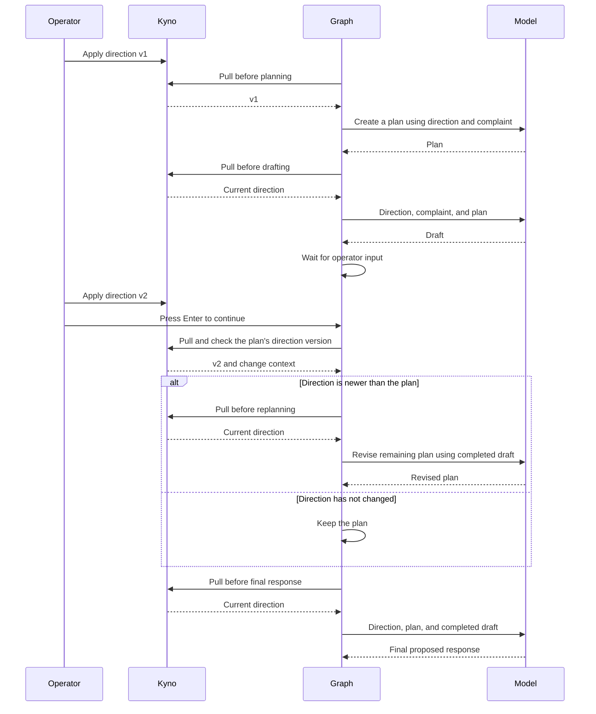

# Direction changes during a customer-support run

For the same cycle using CrewAI, see the [CrewAI walkthrough](CREWAI.md).

Run the full planning and response cycle in one LangGraph workflow:

1. Pull direction and ask the model to make a response plan.
2. Pull again and ask the model to draft a response using that plan.
3. Wait while the operator changes direction in Kyno.
4. Pull again and compare the version with the one used for planning.
5. If it changed, ask the model to revise the remaining plan using the
   completed draft. Otherwise, keep the plan.
6. Pull before asking the model for the final proposed response.

**The graph decides whether to replan. Kyno supplies direction, not workflow
decisions.** Planning, drafting, and finalization all use the LangGraph
adapter's `pull_before` wrapper. There are four model calls when direction
changes and three when it does not.

The customer complaint and permitted actions stay fixed, but the later calls
also receive the plan and completed draft. This is an integration example,
not a controlled comparison that changes only direction. It does not assert
that the model follows the principles or produces a better answer. No refunds,
messages, or other actions are executed.



## Install

The example files live in the repository, not in the installed package.
From a checkout of this revision, create a virtual environment and install:

```bash
python -m venv .venv
source .venv/bin/activate
pip install -e ".[langgraph]" langchain-openai
```

The script uses [LangChain's OpenAI integration](https://docs.langchain.com/oss/python/integrations/chat/openai).
Choose an available model in your account; there is no default model. Real
calls require `--allow-model-calls`, can incur charges, and send the sample
direction and complaint to the provider. No `.env` file is loaded.

## 1. Server terminal

Use an isolated workspace for this example. Activate the same environment
in each terminal. These commands use Bash syntax.

```bash
kyno new /tmp/kyno-support-instance
cd /tmp/kyno-support-instance
kyno db init
kyno token add support-agent --scope read
kyno token add support-operator --scope write
kyno serve --transport http
```

Keep the two printed token values separate. Give the read token to the agent
terminal and the write token only to the operator terminal. Do not paste
either into direction files or model messages. Use your server's actual URL
below if it differs from `http://127.0.0.1:2256`.

## 2. Operator terminal

From the repository root:

```bash
read -rsp 'Operator write token: ' KYNO_WRITE_TOKEN; echo
export KYNO_WRITE_TOKEN
kyno remote add --profile support-operator --url http://127.0.0.1:2256 --token-env KYNO_WRITE_TOKEN
kyno apply examples/customer_support/direction-v1.yaml --remote --profile support-operator --note "Initial support direction"
```

Review and confirm the apply. Keep this terminal open for step 4. Use a fresh
constitution for a literal v1 → v2 run; rerunning against existing history
can produce different version numbers. The script reports the actual ones.

## 3. Agent terminal

From the repository root, with no operator credential in this environment:

```bash
unset KYNO_WRITE_TOKEN
read -rsp 'Agent read token: ' KYNO_READ_TOKEN; echo
export KYNO_READ_TOKEN
read -rsp 'OpenAI API key: ' OPENAI_API_KEY; echo
export OPENAI_API_KEY
read -rp 'OpenAI model ID: ' MODEL
python examples/customer_support/run.py --url http://127.0.0.1:2256 --model "$MODEL" --allow-model-calls
```

The script prints the plan and first draft, each with its run ID, step ID,
constitution, direction version, and binding status. It then waits for your input.
This is an ordinary
input pause inside the same graph invocation, not checkpoint persistence or
a Kyno orchestration feature. Do not press Enter until the next apply succeeds.

## 4. Apply the revision and continue

In the **operator terminal**:

```bash
kyno apply examples/customer_support/direction-v2.yaml --remote --profile support-operator --note "Explain remedies and preserve customer choice"
```

Return to the agent terminal and press Enter. The graph checks direction.
When the version is newer than the plan's version, it calls the model to revise
the unfinished plan, then calls the model for the final response. The completed
draft remains in graph state and is included in both calls; the drafting node
does not run again. With no update, the graph skips replanning.

## Where planning belongs

In `run.py`, `model_node()` wraps every model call with `pull_before(binder)`.
Planning nodes store the returned plan and the direction version supplied to
that call. `check_direction()` pulls at the application's chosen review boundary;
the graph's conditional edge routes to `replan` or directly to `second_answer`.

The graph stores its planning version itself because it already receives
direction through the adapter. It does not also call `binder.plan()`, which
would introduce another read. Applications without this graph state can use
the SDK's `PlanTracker` for that bookkeeping.

These pulls are separate reads, not one locked snapshot. Another operator
update can arrive between planning and execution. Each model call receives
freshly pulled direction, but this example checks whether to replan only at
the explicit review boundary. Your application chooses its own boundaries
and what to do with work already completed.

## Optional recording

No JSONL file is written by default. To retain a run, add
`--record /path/to/new-recording.jsonl` to the agent command. Use `umask 077`
before running and choose a private location. Existing files are refused.
Disable any separately configured LangSmith tracing if you do not intend to
send prompts or responses there. Your model provider's retention settings
still apply.

Each call produces two separate events:

- `direction_supplied`: run/call/step IDs, model ID, constitution, version,
  binding status, detail level, exact rendered direction, fixed scenario,
  task prompt (including the plan and draft when applicable),
  and the time immediately before the model call.
- `model_output`: the same call identity, capture time, and the full serialized
  LangChain response message, including its content and response metadata.

The response is not rewritten or replaced with an expected answer. A receipt
without an output event means no completed response was recorded; the model
call or recording may have failed. The script stops on errors and does not
retry model calls. A failed pull or unwritten constitution stops before
inference rather than using cached or empty direction. That strict choice
belongs to this evidence example, not the adapter's default failure policy.

Recordings can contain sensitive direction and model output. Review them
before sharing. This is not the public replay demo: any later replay must
be labeled as recorded and use the matching scenario, direction, and responses.

## Test without a model provider

```bash
pip install -e ".[dev,langgraph]"
python -m pytest -q tests/surface/e2e/test_customer_support_example.py tests/surface/integration/test_customer_support_recording.py
```

These tests use a deterministic model substitute, real LangGraph execution,
and an authenticated Kyno HTTP server. They test direction delivery and
record correlation, not model obedience. No provider API key is required.
