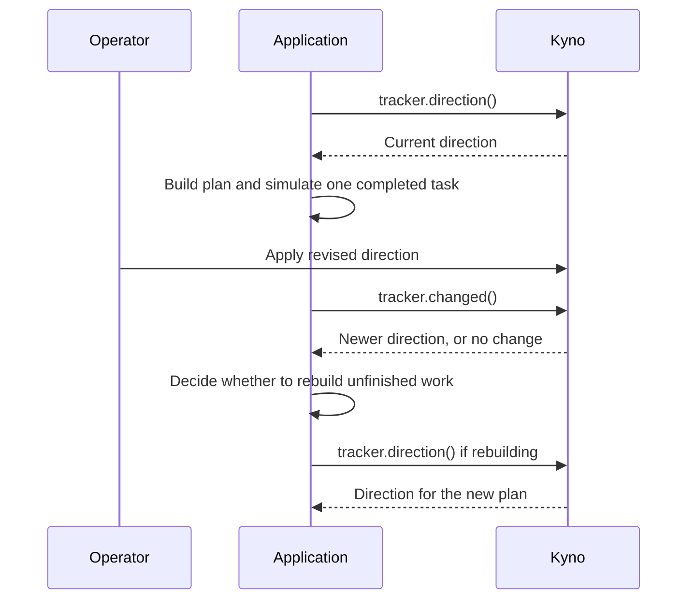

# Pull direction before planning

This application pulls direction from Kyno, builds a checklist, and simulates
completing its first task. It then waits while you change direction. When it
continues, it checks for a newer version and rebuilds the unfinished checklist.

**Kyno supplies direction. The application decides to rebuild the plan.**
`build_plan()` is a deliberately scripted planner: each principle title becomes
a review task. It does not call a model, infer a workflow, or perform any actions.
No framework or model API key is required.



## Run it

From a repository checkout, create and activate a virtual environment, then run
`pip install -e .`. The example files are in the checkout, not the wheel.
Activate the same environment in each terminal below. Commands use Bash syntax.

### 1. Start an isolated Kyno server

```bash
kyno new /tmp/kyno-planning-instance
cd /tmp/kyno-planning-instance
kyno db init
kyno token add planner --scope read
kyno token add operator --scope write
kyno serve --transport http
```

Keep the printed read and write tokens separate. Use your server's actual URL
if it differs from `http://127.0.0.1:2256`.

### 2. Apply initial direction in an operator terminal

From the repository root:

```bash
read -rsp 'Operator write token: ' KYNO_WRITE_TOKEN; echo
export KYNO_WRITE_TOKEN
kyno remote add --profile planning-operator --url http://127.0.0.1:2256 --token-env KYNO_WRITE_TOKEN
kyno apply examples/planning/direction-v1.yaml --remote --profile planning-operator --note "Initial review order"
```

Review and confirm the apply. A fresh constitution starts at version 1;
rerunning these steps uses the actual version numbers in your server.

### 3. Run the planner in another terminal

From the repository root:

```bash
unset KYNO_WRITE_TOKEN
read -rsp 'Planner read token: ' KYNO_READ_TOKEN; echo
export KYNO_READ_TOKEN
python examples/planning/run.py --url http://127.0.0.1:2256
```

The script prints its plan and simulates completing `Check the delivery facts`.
It then waits. It loads no `.env` file and needs no write credential.

### 4. Change direction, then continue

In the operator terminal:

```bash
kyno apply examples/planning/direction-v2.yaml --remote --profile planning-operator --note "Prioritize urgent complaints"
```

Press Enter in the planner terminal. The remaining checklist now includes
`Review urgent complaints first` instead of `Review complaints in arrival order`.
The completed task is not repeated. To exercise the unchanged path, run again
and press Enter without applying another version.

## What belongs to the application

- `binder.plan()` creates a tracker; `tracker.direction()` pulls direction and
  remembers the version used for planning.
- `tracker.changed()` pulls again and returns a newer direction or `None`.
  It does not revise the plan. The `if` statement in `run_example()` makes that choice.
- Rebuilding calls `tracker.direction()` again to mark the new planning version.
  If another update arrived meanwhile, that pull may return a newer version.
- This application keeps completed tasks by matching their titles. That is an
  example policy, not Kyno behavior or a recommended identity scheme for real tasks.
- The example chooses `PullPolicy(fail_closed=True)`: an unavailable server stops
  planning rather than treating a cached response as evidence of no change.
  Unwritten direction and an empty checklist also stop the example.

A real application can replace `build_plan()` with its own planner and choose
where to check for changes. Checking once is not a guarantee that direction will
remain unchanged while the rest of the work executes.
